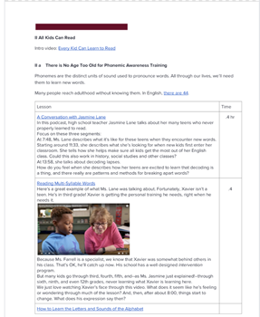

# teen-literacy-matters

An open source industry credential for high school credit
https://docs.google.com/document/d/1cmw3UqX7Dio0qnjAAOIj53lcTPHESuryw6j9baSSr3I/edit#

 

___________________________________________________________

Built by the High School Remixed
[Teen Literacy Team](https://docs.google.com/document/d/1cmw3UqX7Dio0qnjAAOIj53lcTPHESuryw6j9baSSr3I/edit?usp=sharing)

View the 

___________________________________________________________

#### Initially built and tested for Ohio's Industry Credentials program:
[Process for Adding new Industry-Recognized Credentials](http://education.ohio.gov/Topics/Ohio-s-Graduation-Requirements/Industry-Recognized-Credentials/Process-for-adding-new-industry-recognized-credent)

Application form for new industry credential: https://www.surveymonkey.com/r/TFM7QMW

[Intro to Ohio's Industry Credentials Program](http://education.ohio.gov/Topics/Ohio-s-Graduation-Requirements/Industry-Recognized-Credentials)

